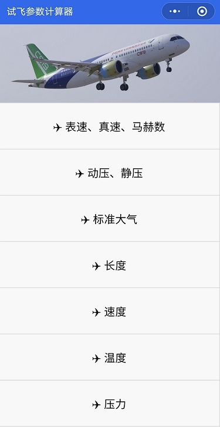
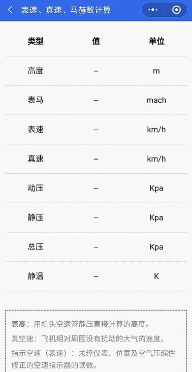

# FormulaDerivation--试飞参数计算器

## 技术框架
* [微信小程序原生语言](https://developers.weixin.qq.com/miniprogram/dev/framework/)

## UI框架
* [WeUI](https://weui.io/)

## 实现功能
* 表速、真速、马赫数计算
* 动压、静压计算
* 标准大气物理量计算
* 长度单位计算
* 速度单位计算

## 截图

## Contribution
RuShi

## License
MIT